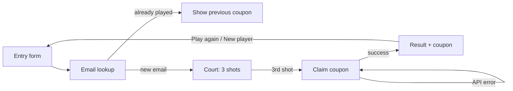

# Quantum Anniversary Game — Developer Guide

Developer reference for the Quantum.lk 20-year anniversary basketball campaign. This is a pnpm workspace: the playable game is a React app, and the API server mints WordPress coupons and appends every round to a Google Sheet.

## Tech stack

| Layer | Choice | Notes |
| --- | --- | --- |
| Package manager | **pnpm workspaces** | npm and yarn are blocked by a `preinstall` hook. Use Linux/WSL Node, not Windows Node. |
| Language | **TypeScript ~5.9**, target ES2022 | Project references in `tsconfig.json` for `lib/*` packages. |
| Game UI | **React 19.1**, **Vite 7**, **wouter** | Single-page app in `artifacts/quantum-anniversary-game`. |
| Styling | **Tailwind CSS 4**, **Radix UI**, **lucide-react** | Tokens from [Quantum Fitness](https://quantum-f2.mayahive.dev/): primary `#ea078c`, hover `#550333`, secondary `#685bc7`, canvas `#f7f5f6`. Fonts: **Exo** (headings), **Poppins** (body/buttons). |
| Data fetching | **TanStack Query**, **Orval** | Generated React Query client in `lib/api-client-react`. The game calls `POST /api/campaign/lookup` and `POST /api/campaign/complete`. |
| API | **Express 5**, **pino**, **googleapis** | `artifacts/api-server`. Health check, returning-player lookup, coupon generation, and Google Sheets append. |
| Validation | **Zod v4**, **drizzle-zod** | Shared schemas in `lib/api-zod`. |
| Database (scaffold) | **PostgreSQL + Drizzle ORM** | `lib/db`. Schema is empty; `DATABASE_URL` is required to push. |
| API contract | **OpenAPI 3.1** + Orval codegen | Source of truth: `lib/api-spec/openapi.yaml`. |
| API bundle | **esbuild** → ESM `.mjs` | Production API runs `node --enable-source-maps artifacts/api-server/dist/index.mjs`. |
| Runtime | **Node.js** (workspace originally targets Node 24 on Replit) | Vite and the API both require `PORT`. |

### Workspace packages

```
artifacts/
  quantum-anniversary-game   @workspace/quantum-anniversary-game   playable campaign site
  api-server                 @workspace/api-server                 Express API scaffold
  mockup-sandbox             @workspace/mockup-sandbox             component preview (dev only)
lib/
  api-spec                   @workspace/api-spec                   OpenAPI + Orval codegen
  api-zod                    @workspace/api-zod                    generated Zod schemas
  api-client-react           @workspace/api-client-react           generated React Query client
  db                         @workspace/db                         Drizzle + Postgres
scripts/                     @workspace/scripts                    one-off scripts
```

Shared dependency versions live in the root `pnpm-workspace.yaml` `catalog`. Do not pin catalog packages in individual `package.json` files unless they must diverge.

### Local setup

```bash
corepack enable
corepack prepare pnpm@latest --activate
pnpm install
```

Do not run `npm i`. In WSL, `which npm` / `which node` must point at Linux binaries, not `/mnt/c/Program Files/nodejs/...`.

Useful commands:

```bash
pnpm run dev                          # game on PORT 20033 (proxies /api to 8080)
PORT=8080 pnpm --filter @workspace/api-server run dev
pnpm --filter @workspace/quantum-anniversary-game run dev
pnpm run typecheck
pnpm run build
pnpm --filter @workspace/api-spec run codegen
pnpm --filter @workspace/db run push          # needs DATABASE_URL; dev only
```

Copy `.env.example` to `.env` and set:

- `FRONTEND_API_SECRET` — HMAC secret shared with WordPress
- `BACKEND_ENDPOINT` — WordPress coupon URL (e.g. `https://quantum-f2.mayahive.dev/wp-json/custom/v1/generate-coupon`)
- `GOOGLE_SHEETS_SPREADSHEET_ID` — ID from the spreadsheet URL
- `GOOGLE_SHEETS_TAB` — tab name (default `Campaign`)
- `GOOGLE_SERVICE_ACCOUNT_EMAIL` — service account client email
- `GOOGLE_PRIVATE_KEY` — PEM key; keep `\n` escaped in the `.env` line

Share the spreadsheet with the service account email as **Editor**. Enable the Google Sheets API on the Google Cloud project. Do not prefix these with `VITE_`; they must not reach the browser.

The API process loads `.env` from the workspace root.

Vite and the API throw if `PORT` is missing. The game also reads `BASE_PATH` (default `/`). For a local production preview of the game:

```bash
PORT=4173 BASE_PATH=/ pnpm --filter @workspace/quantum-anniversary-game run build
PORT=4173 BASE_PATH=/ pnpm --filter @workspace/quantum-anniversary-game run serve
```

---

## Functionality

The product is a **Quantum.lk anniversary microsite**: visitors enter contact details, take three shots at four hidden-discount hoops, and keep the highest reward they land.

### Player flow



1. **Entry** — name, email, phone. After client-side validation the game calls `POST /api/campaign/lookup`. If that email already played, the form stays put and shows the stored coupon (if any). Lookup errors do not start the game.
2. **Game** — press/hold the ball, drag to aim, release to shoot. Mouse and touch both work (`pointer` events).
3. **Claiming** — after the third shot the game calls `POST /api/campaign/complete`. If `best === 0`, WordPress is skipped. API errors stay on this screen with Retry.
4. **Result** — shows best discount, per-shot breakdown, play-again, and the coupon code when one was issued.

All of this lives in `artifacts/quantum-anniversary-game/src/App.tsx`. Routing is a single `/` route plus a 404.

### Rules

| Rule | Implementation |
| --- | --- |
| Four hoops, hidden rewards | `HOOP_REWARDS = [5, 10, 15, 25]`. Shuffled once per player into `hoopRewards`. |
| Three shots | `MAX_SHOTS = 3`. After the third shot the UI moves to the claiming screen, then result. |
| Final prize | Highest landed discount across the three attempts (`best`). Misses do not overwrite `best`. |
| Hit detection | Closest hoop by X; a hit requires `xDistance <= 0.085` and `yDistance <= 0.22` from the hoop target (`y ≈ 0.31`). Releases outside that zone are misses. |
| Persistence | `localStorage` key `quantum-hoops-anniversary-session`. Survives a mobile refresh mid-round. Restart clears it. |

Hoop X positions: `[0.13, 0.375, 0.62, 0.86]` (normalized court width).

To change discount values, edit `HOOP_REWARDS` only. The shuffle, hit logic, and result UI all derive from that constant.

### Campaign Google Sheet (staff only)

Each completed round appends one row to the Google Sheet configured by `GOOGLE_SHEETS_SPREADSHEET_ID` / `GOOGLE_SHEETS_TAB`. Columns:

`player_name,email,phone,shot_1_discount,shot_2_discount,shot_3_discount,best_discount,coupon_code,timestamp`

Staff open that spreadsheet in Google. There is no in-game CSV download URL.

Emails are stored lowercase. `POST /api/campaign/lookup` and `POST /api/campaign/complete` both check an in-memory map loaded from the sheet (one read on first use). Lookups do not hit Google on every form submit. If the sheet cannot be loaded, lookup and complete **fail closed**.

If `complete` mints a WordPress coupon and then the Sheets append fails, the UI can retry. A later retry will not add a duplicate row once the first append succeeds; it may still call WordPress again if the append never landed.

The HMAC secret stays on the server; the lookup response is only `{ exists, couponCode }`.

### Coupon API

`POST /api/campaign/complete` re-checks the email first. Returning players get the stored coupon and skip WordPress and Sheets. New players: sign `email|amount|timestamp` with HMAC-SHA256 and POST to `BACKEND_ENDPOINT` when `best > 0`, then append the Google Sheet row. Amount is the player's best discount.

If this returns 502, WordPress or Google Sheets failed. Confirm `FRONTEND_API_SECRET` in WordPress matches `.env`, and that the service account can edit the spreadsheet.

The game Vite server proxies `/api` to `http://127.0.0.1:8080`. If the API is not running, the proxy returns 503 with a JSON message. Run both:

```bash
PORT=8080 pnpm --filter @workspace/api-server run dev
pnpm run dev
```

After changing the OpenAPI spec, regenerate clients:

```bash
pnpm --filter @workspace/api-spec run codegen
```

That updates `lib/api-client-react` and `lib/api-zod`. Then implement matching Express routes under `artifacts/api-server/src/routes/`.

---

## How to add production servers

Production is declared per artifact in `.replit-artifact/artifact.toml`, not in a root Dockerfile. Each `[[services]]` block can have `[services.development]` (local run) and `[services.production]` (build + serve).

Two production modes are used in this workspace:

| Mode | When to use | Example |
| --- | --- | --- |
| **Static** | SPA / no Node process at runtime | game: `serve = "static"` |
| **Process** | Express (or any long-running Node server) | API: `run.args = ["node", ...]` |

### What is already configured

**Game** — `artifacts/quantum-anniversary-game/.replit-artifact/artifact.toml`

- Dev: Vite on port `20033`, path `/`
- Production: `pnpm --filter @workspace/quantum-anniversary-game run build`
- Serves `artifacts/quantum-anniversary-game/dist/public` as static files
- SPA rewrite: `/*` → `/index.html`

**API** — `artifacts/api-server/.replit-artifact/artifact.toml`

- Dev: `pnpm --filter @workspace/api-server run dev` on port `8080`, path `/api`
- Production build: `pnpm --filter @workspace/api-server run build` with `NODE_ENV=production`
- Production run: `node --enable-source-maps artifacts/api-server/dist/index.mjs` (not through pnpm, faster cold start)
- Health: `GET /api/healthz`

**Mockup sandbox** has development only (port `8081`, `/__mockup`). Do not add production for it unless you intentionally want the canvas in prod.

### Add a static production server (frontend)

Use this when the artifact is a Vite React app that builds to static files.

1. Confirm the Vite `build.outDir` (this game uses `dist/public`).
2. In that artifact’s `artifact.toml`, add or extend:

```toml
[[services]]
name = "web"
paths = [ "/" ]          # public URL prefix
localPort = 20033        # must match PORT in [services.env]

[services.development]
run = "pnpm --filter @workspace/<package-name> run dev"

[services.production]
build = [ "pnpm", "--filter", "@workspace/<package-name>", "run", "build" ]
serve = "static"
publicDir = "artifacts/<artifact-folder>/dist/public"

[[services.production.rewrites]]
from = "/*"
to = "/index.html"

[services.env]
PORT = "20033"
BASE_PATH = "/"
```

3. Keep `BASE_PATH` aligned with `paths` and Vite `base`. If the site is mounted at `/campaign/`, set `BASE_PATH = "/campaign/"` and `paths = [ "/campaign/" ]`.
4. Give the service a unique `localPort`. Do not collide with `20033` (game), `8080` (API), or `8081` (mockup).

### Add a Node production server (API / workers)

Use this when the artifact needs a running process (Express, webhooks, Sheets sync).

1. Package must expose `build` (esbuild to `dist/index.mjs`) and listen on `process.env.PORT`.
2. Add:

```toml
[[services]]
localPort = 8080
name = "API Server"
paths = ["/api"]

[services.development]
run = "pnpm --filter @workspace/<package-name> run dev"

[services.production]

[services.production.build]
args = ["pnpm", "--filter", "@workspace/<package-name>", "run", "build"]

[services.production.build.env]
NODE_ENV = "production"

[services.production.run]
args = ["node", "--enable-source-maps", "artifacts/<artifact-folder>/dist/index.mjs"]

[services.production.run.env]
PORT = "8080"
NODE_ENV = "production"

[services.production.health.startup]
path = "/api/healthz"
```

3. Implement a cheap health route and point `health.startup.path` at it. Production will not mark the service ready until that path returns success.
4. Put secrets (`DATABASE_URL`, Sheets credentials) in the host’s secret store, not in `artifact.toml`. The API already requires `DATABASE_URL` as soon as `lib/db` is imported.

### Checklist for a new production service

- [ ] New or existing package under `artifacts/` listed in `pnpm-workspace.yaml` (`packages: artifacts/*`).
- [ ] Unique `localPort` and `paths` that do not overlap another service.
- [ ] `[services.development].run` uses `pnpm --filter @workspace/<name>`.
- [ ] Static: `serve = "static"`, correct `publicDir`, SPA rewrite if using client routing.
- [ ] Process: `production.build` + `production.run` with `node` on the bundled `.mjs`; `PORT` injected in `run.env`.
- [ ] Health check for process servers.
- [ ] `PORT` / `BASE_PATH` (and any `VITE_*`) documented in `[services.env]`.
- [ ] Game remains playable without the new server unless you explicitly require it (coupon claiming and email lookup need the API).

### Coupon + Sheets in production

The static game and the API must both be deployed. Vite proxies `/api` to port 8080 in development. In production the `/api` path is served by `artifacts/api-server`.

HMAC signing and Google Sheets credentials stay on the API only. Keep those secrets in the host secret store, not in the frontend build.

### Gotchas

- Production static serving has **no Node runtime**. Coupon minting, email lookup, and Google Sheets writes require the API process.
- Vite `allowedHosts` is open in this repo (`true`) so Replit/WSL hosts work. Tighten that if you expose the preview beyond the team.
- `package-lock.json` / `yarn.lock` are deleted on install; commit `pnpm-lock.yaml` only.
- Windows npm from WSL fails the `preinstall` `sh` script. Use Ubuntu Node + pnpm.
