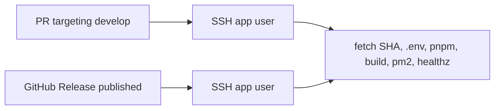

# React application GitHub Actions

**Sources:** [`deploy-development.yml`](../../deploy-development.yml), [`deploy-production.yml`](../../deploy-production.yml)

These files are **templates**. GitHub only runs workflows from `.github/workflows/`. Copy them into **`quantum-anniversary-game`**:

```
quantum-anniversary-game/.github/workflows/deploy-development.yml
quantum-anniversary-game/.github/workflows/deploy-production.yml
```

Do **not** place them under this Ansible repo’s `.github/workflows/` (that would run on cloud-config PRs).

The workflows do **not** run Ansible. They SSH as the application user and mirror [React Application Redeploy](react-redeploy.md): git checkout, `.env`, pnpm install/build, PM2 reload, loopback health check. First-time provision (user, TLS, Nginx, NVM, ACLs) remains [React Application Playbook](react.md).



| File | Trigger | GitHub Environment | Site |
|------|---------|--------------------|------|
| `deploy-development.yml` | `pull_request` to `develop` (`opened`, `synchronize`, `reopened`) | `development` | `qf-anniversary-game.mayahive.dev` |
| `deploy-production.yml` | `release` `types: [published]` | `production` | `anniversarygame.quantum.lk` |

Every PR to `develop` deploys that PR’s SHA onto the **same** development site; the last successful run wins. Production checks out the **release tag**.

## Prerequisites

On each host, `react.yml` must have succeeded with `react.git.remove: false`. The application user must be able to `git fetch` the GitHub remote. NVM, Node `22.13.1`, and the PM2 systemd unit must already exist. Nginx/Certbot/UFW are not changed by CI.

## What the remote script does

1. `cd "$APPLICATION_PATH"` and require `.git`.
2. `git fetch` and `git checkout --force` of the workflow ref (PR head SHA or release tag).
3. Source `~/.nvm/nvm.sh` and `nvm use` `NODE_VERSION`.
4. Upgrade Corepack and activate pnpm (`COREPACK_ENABLE_DOWNLOAD_PROMPT=0`).
5. Insert `rollup: "npm:@rollup/wasm-node"` under `overrides:` in `pnpm-workspace.yaml` if missing (Debian 11 / glibc 2.31).
6. `pnpm install` at the workspace root.
7. Write `.env` (mode `0660`) in the same shape as `roles/react/templates/env.j2`. `GOOGLE_PRIVATE_KEY` is one quoted line with escaped `\n`. `BASE_PATH` is **not** written to `.env`.
8. `pnpm --filter @workspace/quantum-anniversary-game run build` with `NODE_ENV=production` and `BASE_PATH`.
9. `pnpm --filter @workspace/api-server run build`.
10. `pm2 startOrReload ecosystem.config.js --update-env`.
11. `curl -sf --max-time 3 http://127.0.0.1:8080/api/healthz` up to 15 times, 2s apart. Failure fails the job.

## GitHub Environments

Jobs bind to Environments **`development`** (`deploy-development.yml`) and **`production`** (`deploy-production.yml`) on `quantum-anniversary-game`. Both environments use the **same variable and secret names**; only the values differ. The Actions deployment URL is `https://${{ vars.PUBLIC_HOSTNAME }}`.

`BACKEND_ENDPOINT`, `GOOGLE_SHEETS_SPREADSHEET_ID`, `GOOGLE_SHEETS_TAB`, and `GOOGLE_SERVICE_ACCOUNT_EMAIL` are read from **secrets first**, then variables, so either store works. Do not put HMAC secrets or the Google PEM in git.

### Variables

| Name | Development | Production |
|------|-------------|------------|
| `SERVER_HOSTNAME` | Host/IP of the mayahive.dev box (playbook docs use inventory `xeon`) | Host/IP of the quantum.lk box |
| `SERVER_PORT` | `22` | `22` |
| `SERVER_USERNAME` | `qf-anniversary-game-mayahive-dev` | `anniversarygame-quantum-lk` |
| `APPLICATION_PATH` | `/var/www/qf-anniversary-game.mayahive.dev` | `/var/www/anniversarygame.quantum.lk` |
| `PUBLIC_HOSTNAME` | `qf-anniversary-game.mayahive.dev` | `anniversarygame.quantum.lk` |
| `NODE_VERSION` | `22.13.1` | `22.13.1` |
| `PORT` | `8080` | `8080` |
| `NODE_ENV` | `production` | `production` |
| `BASE_PATH` | `/` | `/` |
| `GOOGLE_SHEETS_TAB` | `Players` | `Players` unless production uses another tab |
| `GOOGLE_SERVICE_ACCOUNT_EMAIL` | Service account email | Same or production-specific |
| `GOOGLE_SHEETS_SPREADSHEET_ID` | Spreadsheet ID | Same or production-specific |
| `BACKEND_ENDPOINT` | WordPress coupon URL | Production WordPress URL if different |

`PUBLIC_HOSTNAME` is for operators; the workflows do not read it. Store `BACKEND_ENDPOINT`, spreadsheet ID, or service-account email as **secrets** instead if they should stay hidden in the Actions UI.

### Secrets

| Name | Purpose |
|------|---------|
| `SERVER_SECRET_KEY` | SSH private key for `SERVER_USERNAME` (typically `/home/<user>/.ssh/id_rsa` on the host, with the matching public key in `authorized_keys`) |
| `FRONTEND_API_SECRET` | HMAC shared with WordPress |
| `GOOGLE_PRIVATE_KEY` | Service account PEM as a real multiline secret; the remote script escapes `\n` when writing `.env` |

### Not used by these workflows

Git clone tokens in the Ansible git URL, Cloudflare, Certbot, and Nginx settings. CI uses SSH plus `git fetch` on an existing checkout.
